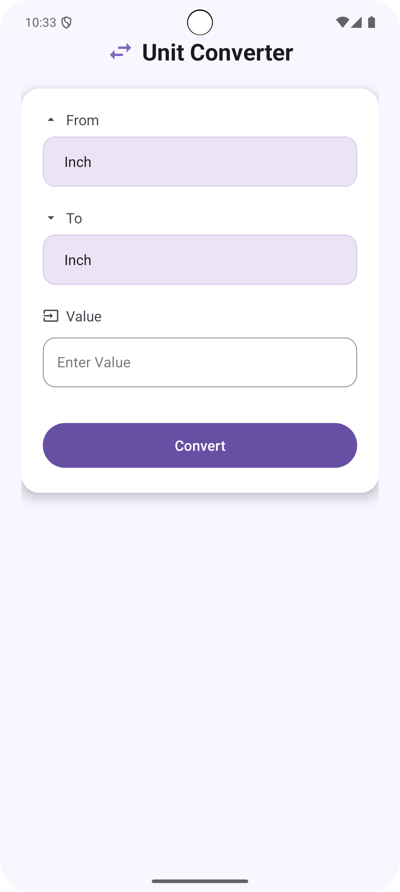
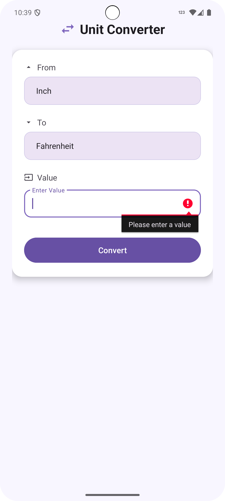
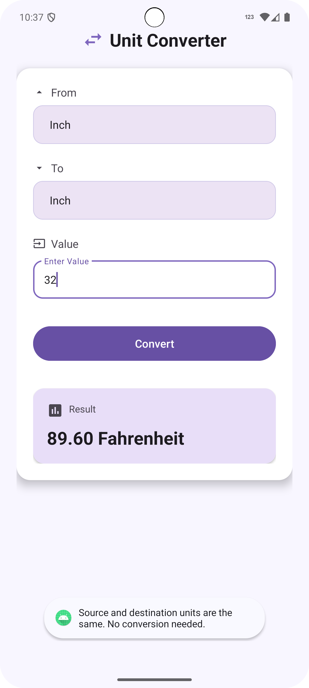

# Unit Converter App

A simple Unit Converter app developed for Android that allows users to convert values between different units in categories like Length, Weight, and Temperature. The app validates input, checks for matching conversion units, and provides an easy-to-use interface with a modern design.

## Features

- **Unit Conversion**: Convert values between units of length, weight, and temperature.
- **Input Validation**: Handles empty inputs, non-numeric inputs, and checks if source and destination units are the same.
- **User-friendly Interface**: Modern design with clear categories and a responsive UI.
- **Error Handling**: Displays error messages for invalid conversions and empty input.
- **Supports Multiple Categories**:
  - Length: Inch, Foot, Yard, Mile, Centimeter, Kilometer
  - Weight: Pound, Ounce, Ton, Gram, Kilogram
  - Temperature: Celsius, Fahrenheit, Kelvin

## Screenshots

### Main Screen
The home screen where users can select the source and destination units and enter a value to be converted.

### Conversion Process and Resultd
Users can input a value and press the "Convert" button to perform the conversion. Once the conversion is complete, the result is displayed in a card view.

### Error Handling
In case of an invalid input or empty value, the app provides appropriate error messages.

### Error Handling
In case of an same input category, the app provides appropriate error messages.

